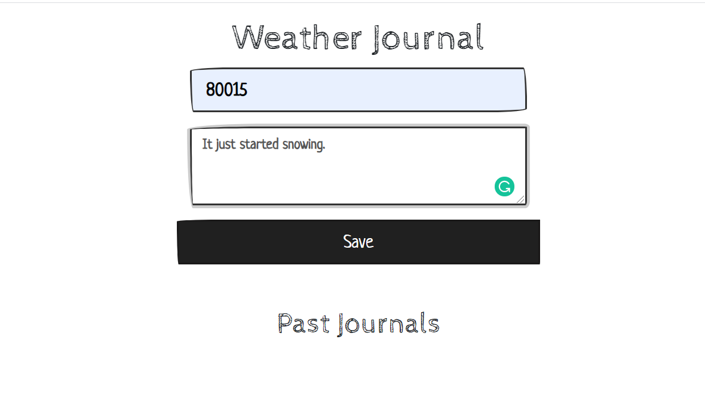
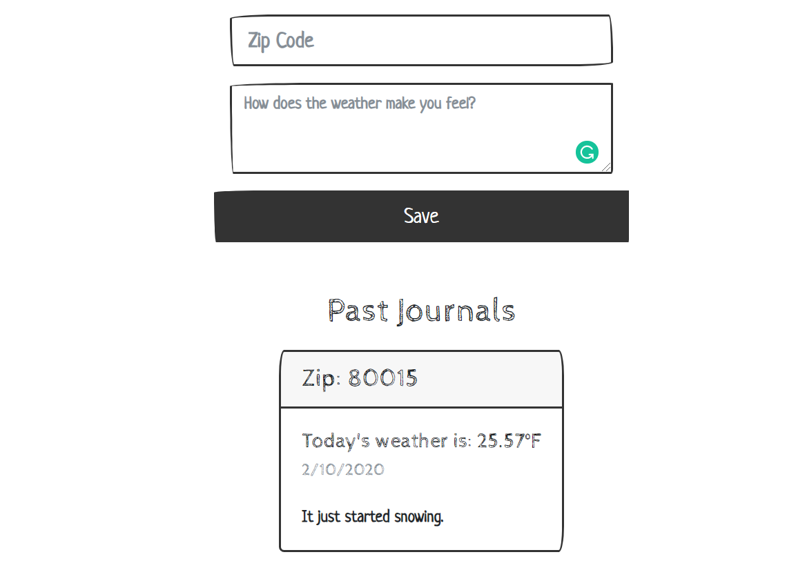

# Weather-Journal App Project

## Overview
This project requires you to create an asynchronous web app that uses Web API and user data to dynamically update the UI.

## Instructions To Run Project
If you already node installed, run in the terminal:
1) npm i -D express
2) npm i -D cors
3) npm i -D body-parser

Then to start the server: 'npm run dev'

## Tool Used:
HTML
CSS
JavaScript
Node.js
Express.js
Bootstrap

---------------------------------------------------

